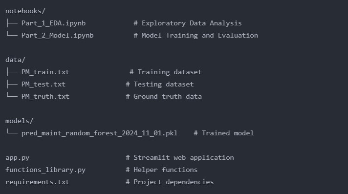

# Aircraft Predictive Maintenance
A machine learning application that predicts the risk of failure in aircraft engines using sensor data, helping to optimize maintenance scheduling and prevent unexpected breakdowns.
Link to the app : https://preventivemaintenanceaeronautics-fjonxrqfymxmggytlrqfew.streamlit.app/

## Table of Contents

- Introduction
- Features
- Project Structure
- Installation
- Usage
- Model Details
- Dependencies
- Documentation
- License

## Introduction
This project implements a predictive maintenance system for aircraft engines using machine learning techniques. It analyzes real-time sensor data to predict potential failures before they occur, enabling proactive maintenance scheduling and reducing downtime. The system uses a Random Forest classifier trained on historical sensor data to categorize the engine's state into three risk levels: Normal, Low Risk, and High Risk.

## Features

- Real-time Risk Assessment: Analyzes 24 different sensor measurements to predict engine failure risk
- Interactive 3D Visualization: PCA-based dimensionality reduction for intuitive data visualization
- Multi-class Classification: Categorizes engine state into three risk levels:
    - Normal Condition (Green)
    - Low Risk of Failure (Orange)
    - High Risk of Failure (Red)

- Sensor Importance Analysis: SHAP values and feature importance visualization
- Web Interface: User-friendly Streamlit dashboard for real-time monitoring
- Customizable Alerting: Different maintenance recommendations based on risk level

## Project Structure

## Installation

1. Clone the repository:
git clone https://github.com/yourusername/aircraft-predictive-maintenance.git
cd aircraft-predictive-maintenance

2. Set up a virtual environment:
python -m venv env
source env/bin/activate  # On Windows use `env\Scripts\activate`

3. Install dependencies:
pip install -r requirements.txt

4. Launch the web application:
streamlit run app.py

## Web Interface
The Streamlit dashboard provides:

1. Real-time sensor data visualization
2. Risk level prediction
3. Maintenance recommendations
4. Interactive 3D PCA plot
5. Feature importance analysis

## Data Format
Input data should include measurements from 24 sensors:
- 3 operational settings
- 21 sensor measurements including temperatures, pressures, speeds, and ratios

## Model Details
Training Data : 
- Historical sensor data from multiple engine units
- Each engine starts from different degrees of initial wear
- Run until failure with sensor readings at each cycle

Machine Learning Pipeline
1. Data Preprocessing:
    - Feature engineering
    - Standardization
    - SMOTE for class balance

2. Model Architecture:
    - Random Forest Classifier
    - Optimized hyperparameters
    - Custom scoring function for maintenance timing

3. Performance Metrics:
    - High recall for Low Risk class (87%)
    - Zero missed critical failures
    - 76% overall accuracy

## Dependencies
- Python 3.8+
- Streamlit
- Scikit-learn
- Pandas
- NumPy
- Plotly
- SHAP

## Documentation
Detailed documentation of the different steps is available in the notebooks:
- Part_1_EDA.ipynb: Comprehensive data analysis and feature engineering
- Part_2_Model.ipynb: Model development, training, and evaluation

## License
This project is licensed under the MIT License - see the LICENSE file for details.

---

Created by Arnaud Duigou